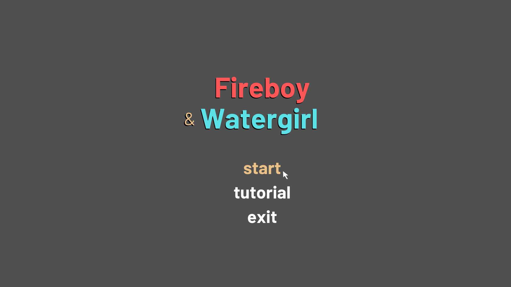
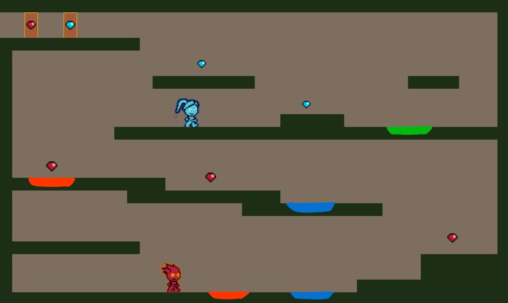
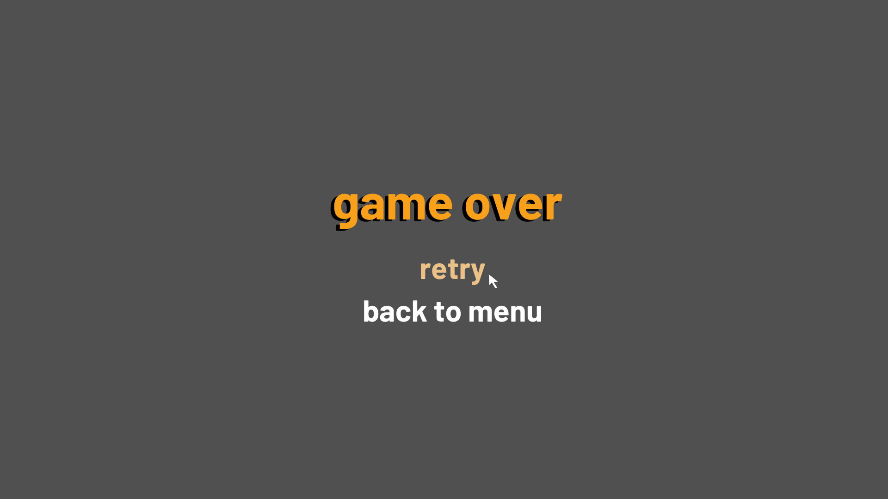
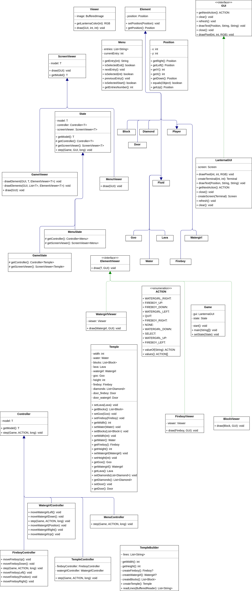

# FEATURES

- Menu - When lauching the game, the menu screen allows the user to start the game (”START”) or exit the game (”EXIT”).
- Co-op Gameplay - Two characters (Fireboy and Watergirl) are controlled by two players at the same time.
- Levels - The game has three different levels to play.
- Player Movement - The characters are able to move left, right, up and down. Fireboy’s movement is done pressing the arrow keys, while Watergirl’s uses “W”, “A”, "S", “D”. Both character are animated to simulate their movement.
- Player Collision - The game checks for collision with lava, water, goo and the diamonds.
- Elemental Reaction - Fireboy can safely walk on lava but gets hurt by water, while Watergirl can walk on water but gets hurt by lava. Both players are hurt by the green goo. If any of the players is hurt, the game ends.
- Collectible Diamonds - The characters need to collect the diamonds to be able to complete the level.
- Game Over - If the player loses, there is a Game Over screen where the player can choose to either play again or exit the game.

# DESCRIPTION

Our game is a two-player cooperative adventure inspired by the classic Fireboy and Watergirl series. Players control two characters—Fireboy and Watergirl—working together to complete three levels.

Fireboy is controlled using the arrow keys, while Watergirl uses "W, A, D." The characters can move left, right, and jump, and their goal is to navigate obstacles, collect diamonds, and reach the exit door of each level. Each character interacts differently with the environment: Fireboy is immune to lava but can’t touch water, while Watergirl is safe in water but harmed by lava. Both must avoid green goo at all costs.

The game starts with a menu where players can choose to play, view instructions, or exit. If a character touches an obstacle they can't survive, it’s Game Over, and players can choose to retry or quit.

Teamwork is essential to press buttons, pull levers, and solve puzzles to advance through the levels. The game focuses on collaboration, problem-solving, and having fun!

# Mockups

# UML MODEL

