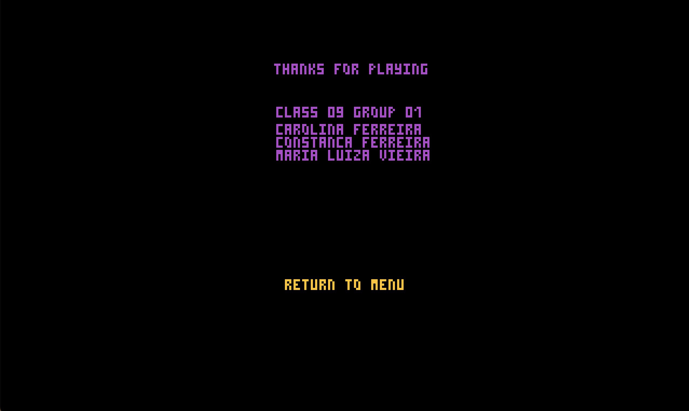
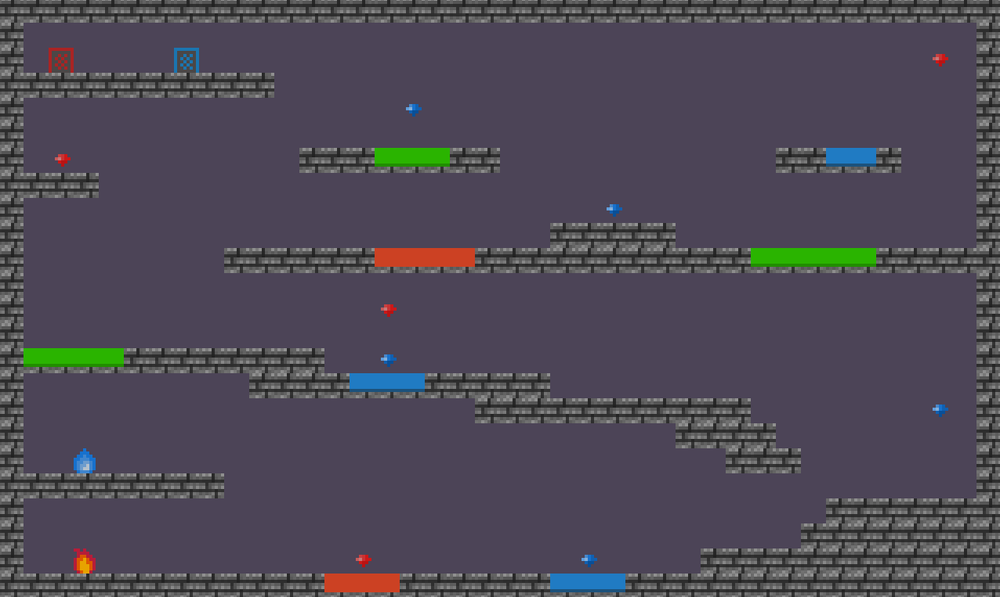

# LDTS_T09_G01 - Fireboy and Watergirl

## Game Description
Fireboy and Watergirl is a cooperative two-player game where the objective is to navigate both characters through a temple with several levels. Each character has unique abilities: Fireboy can walk through fire but must avoid water, while Watergirl can traverse water but must steer clear of fire, both can't touch the green goo. In order to complete a level, each player has to collect all the diamonds of their respective color, Fireboy must collect all red diamonds and Watergirl must collect all the blue diamonds. The game can be played by two people, which requires teamwork, or solo, promoting coordination.

This project was developed by Carolina Ferreira (up202303547), Constança Ferreira (up202306850) and Maria Luiza Vieira (up202304306).

## Features
- **Main Menu Screen** - When the game runs it shows a menu screen with the options to play or to exit.
- **Keyboard control** - The keyboard inputs are received and interpreted according to the current game state.
- **Multiple Players Control** - Movement and actions of Fireboy and Watergirl are managed through the arrow keys and WASD keys respectively. They can move up, down, left and right.
- **Collisions detection** - Collisions in the game environment between different elements are checked (e.g.: goo, fire, water, diamonds). Players can retrieve diamonds if the right collision between diamonds is verified.
- **Players Death** - If the player touches a fluid that does not correspond to their own, it dies and returns to the Main Menu.
- **Different levels** - 3 different levels with different complexities were implemented.
- **Credits** - When the game has successfully ended, a screen is shown with the name of the creators and the option to return to Menu.

## Screenshots
The following screenshots demonstrate both the general look of our game and the divergent functionalities:

### Menus

  

  <b><i>Fig 1. Main Menu </i></b>

<!--  -->
<!--  -->

 
 

  

  <b><i>Fig 2. Game Over </i></b>

  

 
 

  

  <b><i>Fig 3. Credits </i></b>

   

 
 

### Levels

  

  <b><i>Fig 4. Level 1 </i></b>

  

 
 

  

  <b><i>Fig 5. Level 2 </i></b>

  

 
 

  

  <b><i>Fig 6. Level 3 </i></b>

